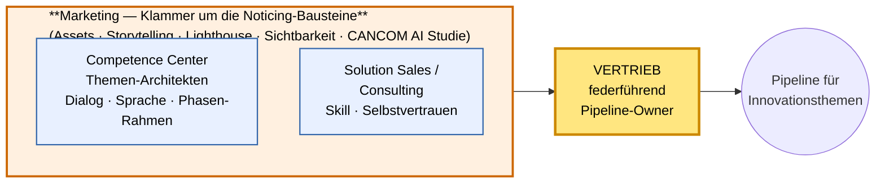
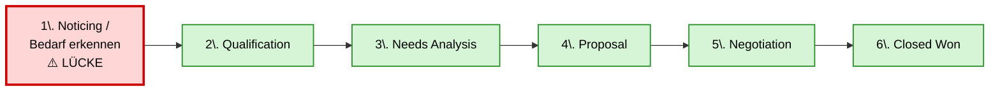

# Wie schaffen WIR es, eine Pipeline für Innovationsthemen zu generieren?

> Ergebnis der Gruppenarbeit (Spazier-Sinnieren) — strukturiert für die kurze Präsentation.

---

## 1. Aufgabe zerlegt — zwei Bauteile

Die Frage trägt zwei Begriffe, die wir vor der Antwort definieren müssen:

| Bauteil | Bedeutung |
|---------|-----------|
| **WIR** | **Vertrieb (federführend)** + Competence Center + Solution Sales / Consulting + Marketing |
| **Pipeline** | Klassische Salesforce-Sales-Stages — von „Bedarf erkennen" bis „Closed Won" |

> 🧠 *Attention Mechanism aktiviert — wir fokussieren erst die Begriffe, dann die Lösung.*

---

## 2. Das WIR — vier Rollen, Vertrieb federführend, Marketing als Klammer

> **Lesart in zwei Sätzen**:
> 1. **Vertrieb ist federführend** — er füllt am Ende die Pipeline. Ohne ihn keine Opp.
> 2. **Marketing ist die Klammer** um die Noticing-Bausteine — es macht die Arbeit von CC und Solution Sales **sichtbar und greifbar** (Assets, Lighthouse-Stories, herstellerneutrale Studien, Reels). Erst durch diese Klammer wird das fachliche Können der Enabler **als Außenkante** spürbar und kann den Vertrieb erreichen.

### Was hindert jede Rolle heute?

| Rolle | Hindernis heute | Was es bräuchte |
|-------|------------------|-----------------|
| **Vertrieb** *(federführend)* | Zeitknappheit durchs Tagesgeschäft · Fokus auf bewährte Themen (sicherer Umsatz) · fehlende Methodenkompetenz für Innovation · Vertrauen in eigene/CANCOMs Innovationslösung fehlt | **Sales Enablement & Methodenkompetenz** · geschützte Zeitfenster für Innovation · Lighthouse-Stories zum Anlehnen · klare Sprache für Kundengespräche |
| **Competence Center** | Reaktiv statt aktiv · Hol-/Bringschuld ungleich · Fach-Sprache statt Kunden-Sprache | Aktive Dialog-Kommunikation · Bedarf ermitteln · Metaphern wie der Kunde |
| **Solution Sales / Consulting** | Reaktiver Modus · geringes Vertrauen in eigene Kompetenz · unklare Org-Verankerung („wie leben die das?") | Skill + Selbstvertrauen · klare Org-Heimat |
| **Marketing** | Herstellergetrieben statt CANCOM-getrieben · wenig eigene Assets | Herstellerneutrale Assets · Lighthouse-Personen pushen · Reels & Studien |

### Übergreifende Hindernisse (treffen alle vier)

- Bequemlichkeit & Verharrungsvermögen
- Sales-Bashing → Vertrauen zerstört
- „Was bringt's mir konkret?" — Benefit unklar
- Fehlende Best Practices, die zeigen: *funktioniert*
- Kein Handlungsdruck → muss durch **Erfolge anderer** und **erste Pilot-Versuche** erzeugt werden

---

## 3. Die Pipeline — wo wir stark sind, wo unsere Lücke ist

| Stage | Status bei uns |
|-------|----------------|
| **1. Noticing / Bedarf erkennen** | ❌ **Hier liegt unsere Lücke** |
| 2. Qualification | ✅ stark |
| 3. Needs Analysis | ✅ stark |
| 4. Proposal | ✅ stark |
| 5. Negotiation | ✅ stark |
| 6. Closed Won / Lost | ✅ stark |

> **Erkenntnis**: Wir sind Profis **ab Stage 2**. Was uns fehlt, ist das **systematische Erkennen, dass Bedarf da ist** — *bevor* der Kunde fragt. Und genau hier sitzt der **Vertrieb** am nächsten am Kunden, braucht aber die richtige **Brille** der drei Enabler.

---

## 4. Stage 1 „Noticing" — was gehört dazu

Stage 1 ist primär **Kommunikations- und Kulturarbeit**, nicht Tool-Arbeit. Die Enabler zahlen auf den Vertrieb ein:

| Baustein | Wer treibt | Was konkret |
|----------|-----------|-------------|
| **Bedarfssensorik beim Kunden** | **Vertrieb** | Sitzt am nächsten am Kunden — hört Signale zuerst, *wenn* er die richtige Brille aufhat |
| **Aktive Kommunikation** | CC + Solution Sales → Vertrieb | Erste Sales-Stufe als **Dialog** führen, nicht als Pitch |
| **Vertrauen aufbauen** | alle vier | Kein Sales-Bashing — gegenseitige Kompetenz anerkennen |
| **Sprache des Kunden** | CC → Vertrieb | Metaphern, Vergleiche, Bilder — Vertrieb braucht das Vokabular, mit dem er innovationssicher auftritt |
| **Strukturierter Rahmen** | CC | Phasen-Modell gibt allen Sicherheit, wann was passiert |
| **Hol- & Bringschuld ausgeglichen** | alle vier | Niemand wartet auf den anderen |
| **Lighthouse-Stories** | Marketing → Vertrieb | Sebastian Wilhelm & Co. nach vorn — Reels, Sichtbarkeit, Reference Stories |
| **Herstellerneutrale Assets** | Marketing | **CANCOM AI Studie**, herunterladbare Whitepaper, eigene Stimme |
| **Sales Enablement & Methodenkompetenz** | CC + Marketing → Vertrieb | Vertrieb wird *befähigt*, Innovationsthemen aktiv zu platzieren |
| **Handlungsdruck** | alle vier | Erfolge anderer sichtbar machen → „die machen das auch" |

---

## 5. Quintessenz — für die Präsentation in 4 Sätzen

1. **WIR** = vier Rollen, **Vertrieb federführend**; CC, Solution Sales/Consulting und Marketing sind die drei **Enabler**, die ihm zuarbeiten.
2. **Pipeline** = klassische SF-Stages — wir sind **ab Stage 2 stark**, **Stage 1 (Noticing) ist die Lücke**.
3. **Stage 1 „Noticing"** ist **Kommunikations- & Kulturarbeit** — die Enabler liefern dem Vertrieb **Sprache, Assets, Methode, Sicherheit**, damit er den Bedarf beim Kunden überhaupt erkennen und benennen kann.
4. **Hindernis Nr. 1** ist nicht Können — sondern **Bequemlichkeit & fehlender Handlungsdruck**. → Erste Aufgabe: an einem Beispiel Erfolg sichtbar machen, damit andere mitziehen wollen.

---

## 6. Talking Points — was ich (Eva) im Vortrag sagen möchte

> Persönliche Pointe — passt zum Thema „Vertrauen aufbauen" und „Handlungsdruck durch Erfolge erzeugen":

- **„Der beste Verkäufer ist der, der das Thema *lebt* und Begeisterung zeigt."**
  Nicht der mit dem besten Pitch — der mit der echten Begeisterung. Begeisterung kann man nicht performen, man muss sie haben.

- **„Es fängt bei einem selbst an."**
  Wir müssen **KI selbst nutzen**, eigene **Erfolge feiern und verstehen**, was sie konkret bewirkt hat. Erst wenn das bei mir sitzt — wenn ich aus eigener Erfahrung erzähle — kann ich es **glaubwürdig nach außen transportieren**.

> 🔗 **Brücke zur Architektur**: Marketing kann noch so viele Assets bauen — wenn die Menschen dahinter (Vertrieb, CC, Solution Sales) das Thema nicht selbst leben, wird die Klammer hohl. **Authentizität ist der unsichtbare Klebstoff** zwischen Klammer und Pipeline.

---

## 7. Optionaler nächster Schritt (Prototyp-Idee)

> Ein **Lighthouse-Pilot**: ein konkretes Innovationsthema (z.B. AI Storage), ein konkreter Kunde, **Vertrieb übernimmt die Kundenführung**, die drei Enabler ziehen synchron — Marketing produziert Asset + Reel, CC führt fachliches Dialog-Briefing, Solution Sales begleitet im Termin. **Output sichtbar machen.** Damit erzeugen wir den Handlungsdruck, der heute fehlt.
