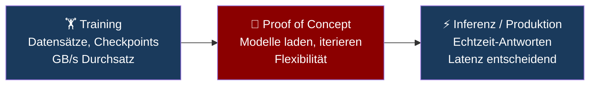

---
tags:
  - ai-storage
  - cancom
  - it-entscheider
  - kv-cache
  - inferenz
  - präsentation
status: aktiv
erstellt: 2026-05-28
hersteller:
  - CANCOM
  - Dell
  - HPE
  - NVIDIA
---

# Storage im AI Pod – Was IT-Entscheider wissen müssen

> [!abstract] Kernaussage
> Storage ist der unsichtbare Engpass jeder KI-Infrastruktur. Wer teure GPUs kauft und Storage als Commodity behandelt, verschenkt Performance – und Geld.

---

## Der CANCOM AI Pod: Fünf Bausteine, ein oft unterschätzter

Der AI Pod ist das Herzstück der CANCOM Physical AI Infrastructure. Er definiert fünf gleichwertige Bausteine – und Storage ist nicht der letzte Posten auf der Einkaufsliste, sondern das Fundament:

| Baustein | Aufgabe |
|---|---|
| **AI Software** | Frameworks, Libraries und Tools für Entwicklung & Optimierung |
| **Data Platform** | Unternehmensdaten strukturieren und AI-ready machen |
| **Compute** | GPUs trainieren und führen Modelle aus |
| **AI Network** | Niedrige Latenz zwischen GPU, Server und Storage |
| **Storage** | Leistungsstarker, skalierbarer Datenspeicher für jeden AI-Lifecycle-Schritt |

> [!warning] Der häufigste Planungsfehler
> Unternehmen investieren in Compute (GPUs) und behandeln Storage wie eine Commodity. Das Problem: **Ein NVIDIA H100 kann bis zu 3,35 TB/s Speicherbandbreite intern verarbeiten – aber nur so schnell wie die Datenzufuhr von außen.** Langsames Storage lässt teure GPUs warten.

---

## KI hat drei Phasen – und jede stellt andere Anforderungen ans Storage



| Phase | Was Storage leisten muss | Kritische Kennzahl |
|---|---|---|
| **Training** | Riesige Datensätze parallel an viele GPUs liefern, Checkpoints schreiben | Durchsatz (GB/s) |
| **Proof of Concept** | Modelle schnell laden, Experimente schnell iterieren | Flexibilität + Speed |
| **Inferenz / Produktion** | Anfragen in Echtzeit beantworten, Cache verwalten | Latenz (µs bis ms) |

> [!info] Merksatz
> **Training = Durchsatz-sensitiv. Inferenz = Latenz-sensitiv.**
> Wer beide Phasen mit derselben Storage-Lösung betreiben will, hat immer einen Kompromiss.

---

## KV-Cache: Die GPU-RAM-Falle bei Inferenz

### Was ist der KV-Cache?

Wenn ein LLM Text generiert, verarbeitet es bei jedem neuen Wort den **gesamten bisherigen Kontext** – also Prompt plus Gesprächsverlauf. Damit es dabei nicht jedes Mal dieselben Zwischenergebnisse neu berechnet, speichert das Modell diese als **Key-Value-Paare** im GPU-RAM.

Das nennt sich **KV-Cache** (Key-Value Cache).

> [!info] Einfache Analogie
> Stell dir vor, du löst eine lange Gleichung. Den Zwischenschritt notierst du auf einem Notizzettel – damit du ihn nicht jedes Mal neu rechnen musst. Je länger das Gespräch, desto mehr Notizzettel. Irgendwann ist der Schreibtisch (= GPU-RAM) voll.

**Das Problem wächst mit der Nutzung:**

- Ein **langes Gespräch** (z. B. 128k Token Kontext) belegt je nach Modell mehrere GB allein für den KV-Cache
- Bei **vielen parallelen Nutzern** multipliziert sich der Bedarf – der GPU-RAM ist schnell erschöpft
- Ein NVIDIA H100 hat 80 GB GPU-RAM – das klingt viel, bis man merkt dass ein einziges großes Modell davon bereits 40–70 GB belegt

---

### KV-Cache-Offloading: Die Lösung wenn der GPU-RAM nicht reicht

Wenn der GPU-RAM voll ist, gibt es zwei Optionen:
1. **Anfragen ablehnen** → schlechte User Experience, Kapazitätsproblem
2. **KV-Cache auslagern** auf schnellen Host-RAM oder NVMe-Storage → **KV-Cache-Offloading**

> [!important] Warum NVMe – und nicht irgendeine SSD?
> Die Latenz entscheidet darüber, ob der Nutzer den Unterschied spürt:
>
> | Speichertyp | Latenz | Für KV-Cache-Offloading geeignet? |
> |---|---|---|
> | GPU-RAM (VRAM) | ~1 µs | ✅ Ideal – aber begrenzt und teuer |
> | Host-RAM (DRAM) | ~100 ns | ✅ Sehr gut – zweite Wahl |
> | **NVMe SSD** | **~100 µs** | **✅ Notwendige Mindestanforderung** |
> | SATA SSD | ~500 µs | ⚠️ 5× langsamer als NVMe – spürbar |
> | HDD | ~10 ms | ❌ Ungeeignet – Faktor 100 zu langsam |
>
> **KV-Cache-Offloading auf SATA-SSD oder HDD bedeutet: der Nutzer wartet.** NVMe ist keine Premium-Option – es ist die Mindestanforderung für produktive LLM-Inferenz.

**Die Konsequenz für die Planung:**
Inferenz-Server brauchen **lokale NVMe-SSDs** oder ein **NVMe-over-Fabric (NVMe-oF) Backend** – nicht nur für Modellgewichte, sondern als Ausweichpuffer für den KV-Cache unter Last.

---

## Die Storage-Hierarchie im AI Pod

Jede Schicht hat ihre Aufgabe – keine kann die andere ersetzen:

```
┌─────────────────────────────────────────────────────────────┐
│  Tier 0  │  GPU-RAM (VRAM)      │ KV-Cache, aktive Rechnung │
│          │  ~1 µs               │ Begrenzt, teuer           │
├─────────────────────────────────────────────────────────────┤
│  Tier 1  │  NVMe (lokal/NVMe-oF)│ KV-Cache-Offloading       │
│          │  ~100 µs             │ Vector DB, Hot Data, DB    │
├─────────────────────────────────────────────────────────────┤
│  Tier 2  │  Paralleles FS       │ Modellgewichte             │
│          │  GB/s Durchsatz      │ Trainingsdaten, Checkpoints│
├─────────────────────────────────────────────────────────────┤
│  Tier 3  │  Object Storage (S3) │ Dokument-Korpus, Rohdaten  │
│          │  hohe Kapazität      │ Archiv, Datasets           │
└─────────────────────────────────────────────────────────────┘
```

---

## RAG-Systeme: Drei Storage-Anforderungen gleichzeitig

RAG (Retrieval-Augmented Generation) ist das Architekturmuster hinter den meisten Enterprise-KI-Lösungen: Das LLM schlägt bei jeder Anfrage in Unternehmensdokumenten nach und gibt eine fundierte Antwort.

Ein RAG-System braucht **gleichzeitig drei verschiedene Storage-Typen**:

| RAG-Komponente | Was sie tut | Storage-Anforderung | Empfehlung |
|---|---|---|---|
| **Dokument-Korpus** | Rohdokumente speichern (PDF, Word, HTML) | Kapazität, S3-kompatibel | Object Storage (MinIO, Dell ObjectScale) |
| **Vector Index** | Bei jeder Anfrage Ähnlichkeitssuche durchführen | Random Read, IOPS-kritisch | NVMe Block Storage |
| **Modellgewichte** | LLM beim Start laden (z.B. Llama 70B = 140 GB) | Hoher Durchsatz, parallel | Paralleles Filesystem (PowerScale, VAST, DDN) |

> [!warning] Wichtige Erkenntnis für IT-Entscheider
> **"Wir haben doch schon ein NAS"** reicht nicht.
> NAS ist für sequentielle Workloads ausgelegt. Der Vector Index arbeitet mit **random-read-heavy**, sehr kleinen Blöcken (< 4 KB) – normales NAS bricht hier ein. NVMe ist Pflicht.

---

## Die drei häufigsten Fehler bei AI Storage

> [!warning] Fehler 1: Ein Storage für alles
> Training, Inferenz und Datenhaltung brauchen unterschiedliche Storage-Typen. Wer alles auf einem System betreibt, hat überall einen Kompromiss – und bezahlt das mit schlechter GPU-Auslastung.

> [!warning] Fehler 2: KV-Cache-Offloading nicht eingeplant
> Wer keinen NVMe-Puffer vorsieht, wird bei wachsender Nutzerzahl entweder Anfragen ablehnen oder nachträglich teurere GPU-RAM-Upgrades kaufen. Dabei ist NVMe die weitaus günstigere Lösung.

> [!warning] Fehler 3: Skalierung nicht mitdenken
> Ein Modell auf einem Node läuft auf normalem NAS. Zehn Nodes laden gleichzeitig dasselbe Modell – normales NAS bricht ein. Parallele Filesysteme (Dell PowerScale F710, VAST, DDN) skalieren den Durchsatz mit der Anzahl der Clients.

---

## Zusammenfassung: Die fünf Fragen die jeder IT-Entscheider stellen sollte

| Frage | Was die Antwort beeinflusst |
|---|---|
| **Welche AI-Workloads laufen?** (Training / Inferenz / RAG) | Durchsatz vs. Latenz als primäres Kriterium |
| **Wie viele parallele Nutzer werden erwartet?** | KV-Cache-Bedarf und Offloading-Kapazität |
| **Wie groß sind die Modelle?** | Notwendiger Durchsatz beim Laden (Parallel-FS erforderlich?) |
| **Welche Latenzanforderungen hat das Business?** | NVMe lokal vs. NVMe-oF vs. konventionelles Storage |
| **Läuft alles on-premises oder hybrid?** | Betriebsmodell und Datensouveränität |

> [!tip] CANCOM liefert den kompletten AI Pod
> Von der richtigen Storage-Architektur für jeden Use Case über das AI Network bis zu Security und Automation – der CANCOM AI Pod adressiert alle fünf Bausteine. Storage ist dabei nicht das letzte Glied der Kette, sondern das Fundament auf dem Compute, Network und Software erst ihr volles Potenzial entfalten.

---

## Verwandte Notizen

- [[04 Ressourcen/AI Storage/Lernkarten Kap 2.1–2.5]] – KV-Cache, Storage-Typen, Latenz-Tabelle
- [[04 Ressourcen/AI Storage/Lernkarten Kap 4.7 – Storage-Muster zu Workloads]] – RAG Storage-Schichten im Detail
- [[04 Ressourcen/AI Storage/Chatbot-Architektur Storage-Relevanz]] – Konkretes RAG-Beispiel mit CANCOM Chatbot
- [[04 Ressourcen/AI Storage/Lernkarten Kapitel 3.1 – Storage-Architektur Überblick]] – Sechs-Bausteine-Modell
